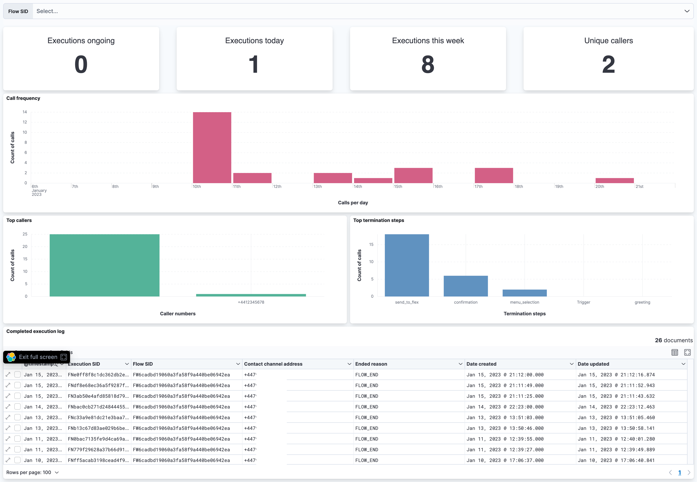

# Twilio Events

The Twilio Events integration enables you to collect, monitor and visualize [Twilio Events](https://www.twilio.com/docs/events/event-types). 

The integration creates an [HTTP endpoint](https://www.elastic.co/guide/en/beats/filebeat/current/filebeat-input-http_endpoint.html), which listens for Twilio events and ingests them into Elasticsearch.

### Usage

**Building the integration** (development only)
- Install `elastic package`: 
    ```bash
    git clone https://github.com/elastic/elastic-package.git
    make build
    ```
- Clone this repository and `cd` into its directory.
- Build the integration using the `elastic-package build` command.
- Spin up the Elastic Stack using the `elastic-package stack up -v -d` command. This starts the `package-registry` updated with the newly build integration.

**Enabling the integration**
- In Kibana, navigate to `Management -> Integrations`
- Search for and install the `Twilio Events` integration
- Configure the endpoint address by setting the `Listen Address`, `Listen port` and `Webhook path` variables. It defaults to: `0.0.0.0:8383/twilio/events`.

**Configure Twilio Event Streams to send events to the integration endpoint**
- In the Twilio Console navigate to `Event Streams -> Manage`.
- Click on `Create new sink` and [create a new webhook sink](https://www.twilio.com/docs/events/webhook-quickstart). 
- Set the sink destination to the endpoint address created in the previous step.
- Subscribe the sink to events.

That's it! Events will now be pushed to Elasticsearch!


### Supported events and fields

For a listed of supported events and fields, please see the autogenerated documentation under `docs/`.


### Demo
<p float="left">
  Messaging dashboard
  

  Studio dashboard
  

  Voice dashboard
  
</p>